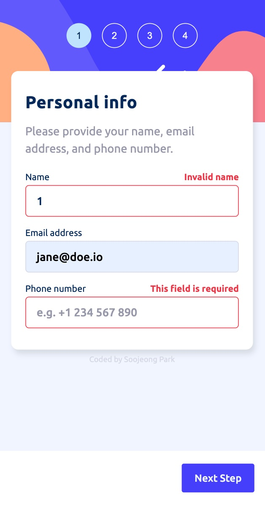
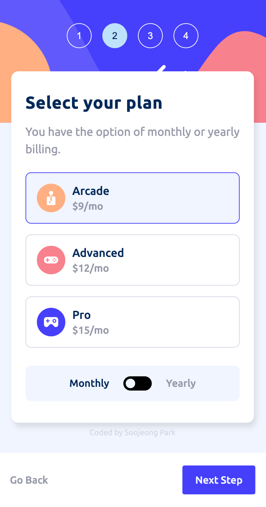
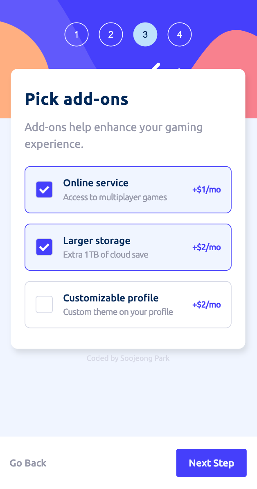
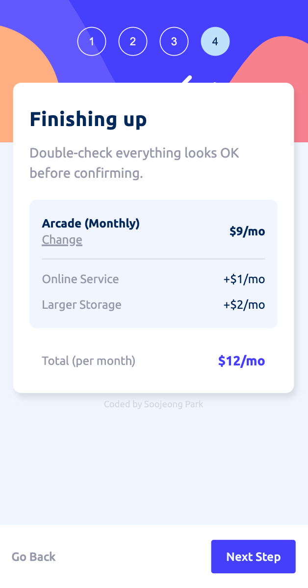
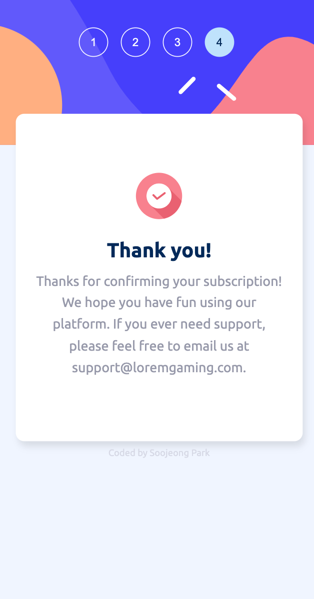
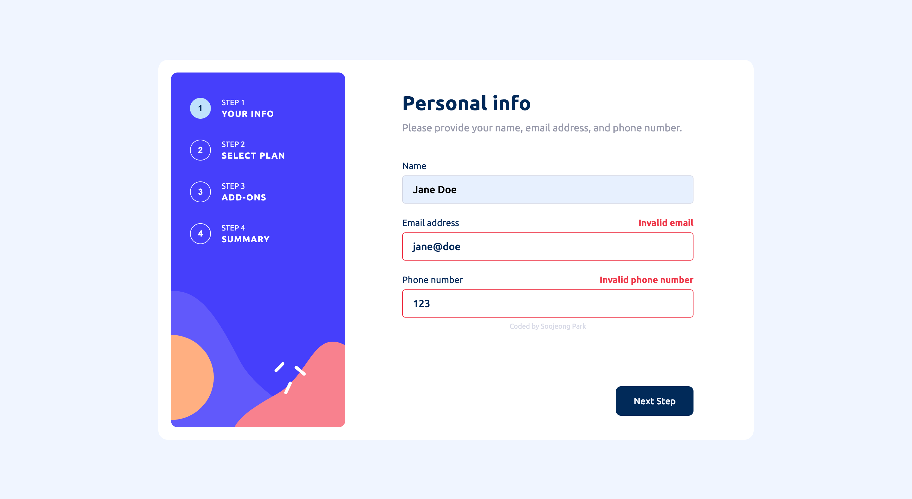
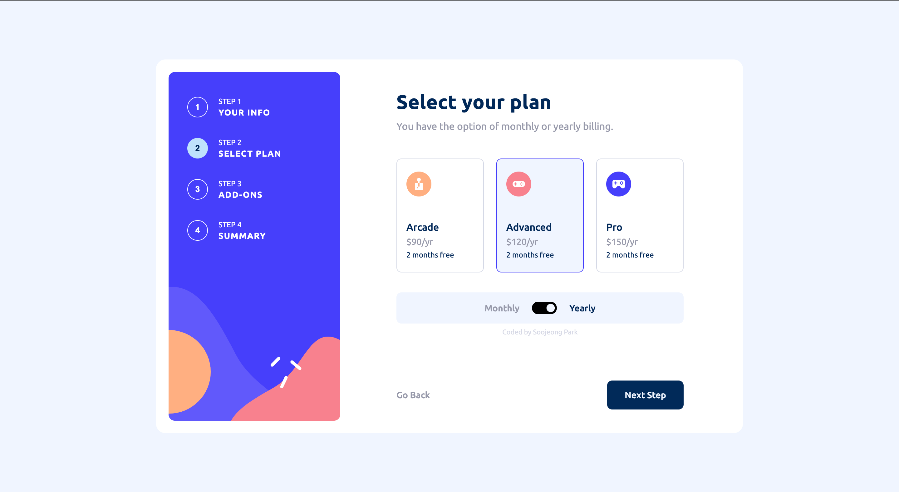
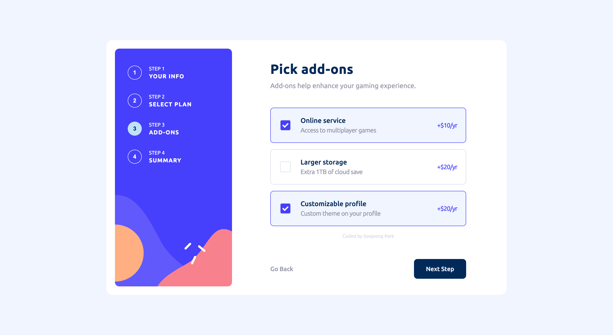
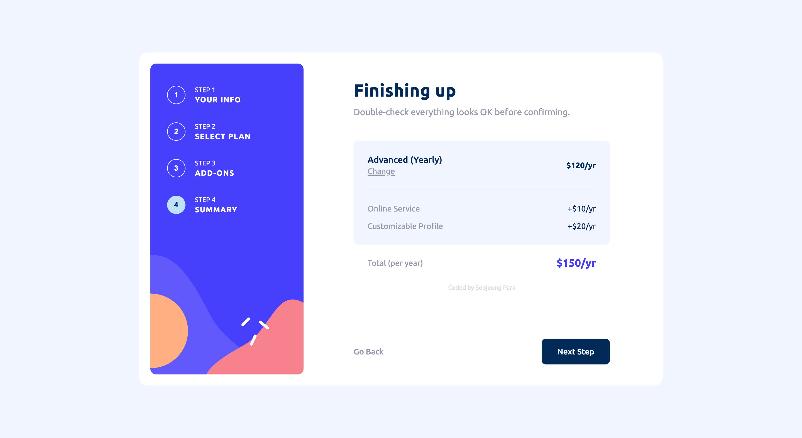
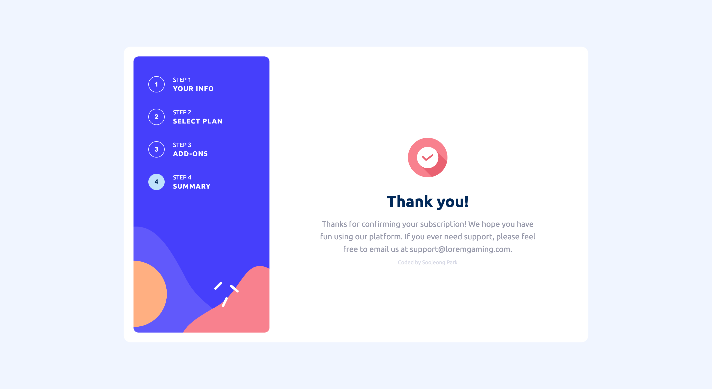

# Multi-step form

A multi-step form website for subscription built with Vanilla JS.<br/>The website was built from scratch based on design provided by [Frontend Mentor](https://www.frontendmentor.io/challenges/multistep-form-YVAnSdqQBJ).

## Table of contents

- [Overview](#overview)
  - [Features](#features)
  - [Screenshot](#screenshot)
  - [Links](#links)
- [My process](#my-process)
  - [Built with](#built-with)
  - [Reflection](#reflection)
- [Author](#author)

## Overview

### Features

Users should be able to:

- Complete each step of the sequence
- Go back to a previous step to update their selections
- See a summary of their selections on the final step and confirm their order
- View the optimal layout for the interface depending on their device's screen size
- See hover and focus states for all interactive elements on the page
- Receive form validation messages if:
  - A field has been missed
  - The email address is not formatted correctly

### Screenshot

#### Mobile version:

    

#### Desktop version:

    

### Demo Link

[💻 Live Site URL](https://spark-multi-step-form.netlify.app/)

## My process

### Built with

- HTML
- CSS (Responsive Website, Mobile-first workflow)
- Vanilla JavaScript

### Reflection

This was a good project to put together my CSS and Vanilla JS skills. Here are some of the main things I worked on to make this website work:

#### CSS

- Used custom Radio inputs for selecting subscription plan so that at least one plan is always checked.
- Custom radio inputs were made by setting the actual input elements' `opacity` to '0' and styling the `label` element.
- Used custom checkboxe inputs for selecting add-ons to the subscription plan.
- Custom checkboxes were made by using `::after` pseudo-elements.
- Used media queries to build a responsive website.

```css
/* checkmark ✔ - nothing yet */
.checkmark::after {
  content: "";
  position: absolute;
  display: none;
}

/* when checked, box for checkmark background changes */
.custom-checkbox input:checked ~ .checkmark {
  background-color: var(--purplish-blue);
}
/* when checked, a white checkmark ✔ appears */
.custom-checkbox input:checked ~ .checkmark::after {
  content: "";
  position: absolute;
  display: block;
  top: 50%;
  left: 50%;

  width: 5px;
  height: 10px;
  border: solid white;
  border-width: 0 3px 3px 0;
  transform: translate(-50%, -60%) rotate(45deg);
  transition: all 0.2s;
}
```

#### Vanilla JS

- To switch from one step to another in this multi-step subscription form, I used functions and event listeners to add and remove "hidden" classes when the next or back button is clicked.
- I made a pricing data object to bring data from that matches with the product and add-ons the user chooses to create a summary for pricing.
- Clicking on the next button saves user's input for each step and this data is updated when changes are made.
- Used regular expressions to check the validity of user's full name, email address, and phone number.
- Used toggle function to toggle between monthly plans and yearly plans and show corresponding add-ons to choose from.
- Used DOM manipulation to show a different summary when no add-ons were chosen, so that it's easier for users to add them if they want to from the summary page.

```js
function displayPlans(planType) {
  const plansToHide = planType === "monthly" ? yearlyPlans : monthlyPlans;
  const plansToShow = planType === "monthly" ? monthlyPlans : yearlyPlans;
  const defaultPlan = plansToShow.querySelector(
    ".form__item--plan .input-radio" // first plan out of three
  );

  btnMonthly.classList.toggle("chosen-period", planType === "monthly");
  btnYearly.classList.toggle("chosen-period", planType === "yearly");
  btnTogglePlans.querySelector("img").src =
    planType === "monthly"
      ? "../assets/images/icon-toggle-left.svg"
      : "../assets/images/icon-toggle-right.svg";

  addHiddenClass(plansToHide);
  removeHiddenClass(plansToShow);

  // remove previously checked plan and show default plan when switching to monthly/yearly plan
  planItems.forEach(item => {
    item.classList.remove("checked");
  });
  defaultPlan.closest(".form__item--plan").classList.add("checked");
  currentUserPlan = defaultPlan;
  currentUserInfo.plan = currentUserPlan.value;
}
```

```js
function createAddOnTextContent() {
  if (addOnTextContentArr.length > 0) {
    return addOnTextContentArr
      .map(i => {
        return `
            <div class="add-on">
              <p class="add-on-name cool-gray-text">
                <span class="add-on-name-title">${i.addOnTitle}</span>
              </p>
              <p class="add-on-price">
                +$<span class="add-on-price-num">${i.addOnPrice}</span>/${
          planPeriodStr === "monthly" ? "mo" : "yr"
        }
              </p>
            </div>
          `;
      })
      .join("");
  } else {
    return `
          <div class="add-on">
            <p class="add-on-name cool-gray-text">
              <span class="add-on-name-title">No add-ons selected</span>
            </p>
            <button class="btn--change-addons cool-gray-text">Add</button>
          </div>
        `;
  }
}

const addOnsContainer = document.querySelector(
  `.chosen-add-ons.chosen-add-ons--${planPeriodStr}`
);
addOnsContainer.innerHTML = createAddOnTextContent();
```

## Author

- Twitter - [@codingsooj](https://www.twitter.com/codingsooj)
